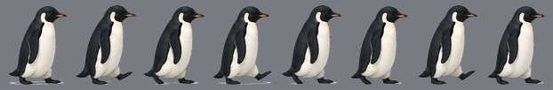
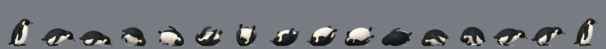
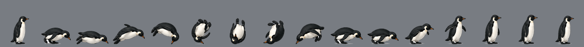
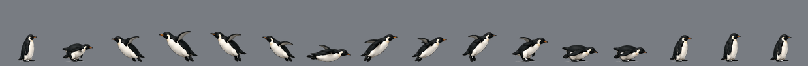
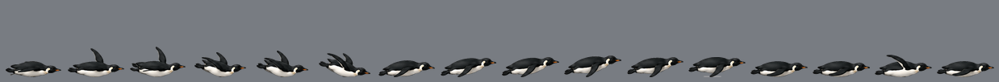

# penguin-walk

A tiny desktop pet for **XFCE / X11**: Tux crosses the bottom of your screen every
now and then. Most of the time he just waddles by; once in a while a crossing throws
in a surprise -- a roll, a somersault, a jump, or a short flight -- then he's gone
again until later.

It's a transparent, click-through, always-on-top overlay. There's no window and
nothing to click -- he just shows up, crosses, and leaves.

## Previews

| | |
|---|---|
| walk |  |
| roll |  |
| somersault |  |
| jump |  |
| fly |  |

## Run

Requirements: Python 3, PyGObject (GTK 3), pycairo, Pillow, NumPy, SciPy, and an X11
session with a compositor on (for the transparency).

```sh
python3 penguin-walk.py
```

He does a hello-crossing ~8s after start, then reappears every 15--45 min at random.
Stop him with `pkill -f penguin-walk.py`.

**Start at login:**

```sh
cp penguin-walk.desktop.example ~/.config/autostart/penguin-walk.desktop
# then edit the Exec= path to wherever you cloned this
```

## Tunables (top of `penguin-walk.py`)

- `MIN_GAP` / `MAX_GAP` -- seconds between crossings
- `SPEED` -- crossing pace (px/s)
- `TRICK_PROB` -- chance a crossing includes one surprise trick
- `MONITOR` -- `'largest'` (default) or an exact geometry like `'3840x2160'`
- `META` -- per-animation lift profile (`'arc'` hop, `'fly'` take-off/glide/land) and
  how many times to loop the trick's frames

## Add your own animations

1. Drop a sprite sheet PNG into `incoming/` -- transparent background, penguin facing
   **left**, laid out in a grid. Number labels and gridlines are fine.
2. Add it to `SHEETS` in `slice_all.py` with a set name.
3. `python3 slice_all.py` -- it auto-detects frames by connected components (filtering
   the number labels and gridlines by size + fill-ratio), scales every sheet by one
   factor so the standing penguin is 90px tall, bottom-aligns + centers them, flips
   them to face right, and writes `frames/<name>/`.
4. For a move that leaves the ground, add a `META` entry in `penguin-walk.py`.

Then restart the daemon; the new set joins the trick rotation automatically.

## How it works

- **`slice_all.py`** turns each sheet into clean, aligned frame sets.
- **`penguin-walk.py`** is the overlay. Each crossing it picks a direction and walks;
  with probability `TRICK_PROB` it weaves in one random trick *in the same stride* --
  ground tricks stay on the floor, the jump arcs, flight lifts off and glides back down.

The penguin art lives in `incoming/`.
